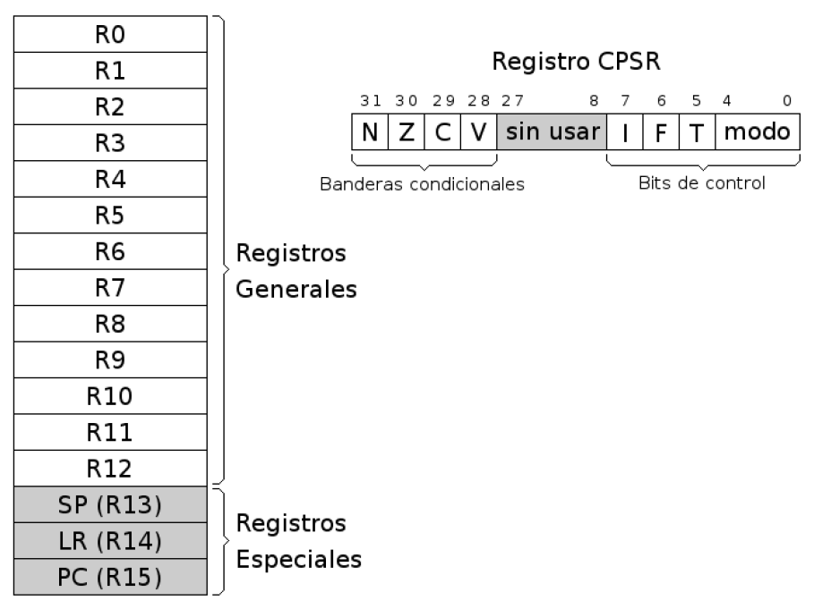
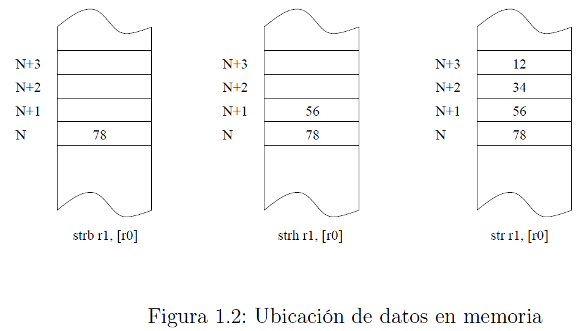

# Resumen de Ensamblador
ARM es una arquitectura RISC (Reduced Instruction Set Computer = Ordenador con Conjunto Reducido de Instrucciones) de 32 bits. Se trata de una arquitectura licenciable, quiere decir que la empresa desarrolladora ARM Holdings diseña la arquitectura, pero son otras compañías las que fabrican y venden los chips, llevándose ARM Holdings un pequeño porcentaje por la licencia.

### Registros


#### Registros Generales
Su función es el almacenamiento temporal de datos.

#### Registros Especiales
- **SP** - Puntero de Pila. Sirve como puntero para almacenar variables locales y registros en llamadas a funciones.
- **LR** - Registro de Enlace. Almacena la dirección de retorno cuando una instrucción BL ó BLX ejecuta una llamada a una rutina.
- **PC** - Contador de Programa. Es un registro que indica la posición donde está el procesador en su secuencia de instrucciones.

#### Registros CPSR
Almacena las banderas condicionales y los bits de control. Los bits de control definen la habilitación de interrupciones normales (I), interrupciones rápidas (F), modo Thumb (T) y el modo de operación de la CPU. Existen hasta 8 modos de operación. Desde el *Modo Usuario* sólo podemos acceder a las banderas condicionaless, que contienen información sobre el estado de la última operación realizada por la ALU. Existen 4 banderas y son las siguientes:
- **N.** Se activa cuando el resultado es negativo.
- **Z.** Se activa cuando el resultado es cero o una comparación es cierta.
- **C.** Indica acarreo en las operaciones aritméticas.
- **V.** Desbordamiento aritmético.

### Esquema de almacenamiento
Cuando escribimos un dato en una posición de memoria, dependiendo de si es byte, half word o word,... se ubica en memoria según el esquema de la figura 1.2. La dirección de un dato es la de su byte menos significativo.



## El lenguaje Ensamblador
El ensamblador es un lenguaje de bajo nivel que permite un control directo de la CPU y todos los elementos asociados. Cada línea de un programa ensamblador consta de una instrucción del procesador y la posición que ocupan los datos de esa instrucción.

El ensamblador se utiliza como apoyo a otros lenguajes de alto nivel para 3 tipos de situcaciones:
- Operaciones que se repitan un número elevado de veces.
- Cuando se requiera una gran velocidad de proceso.
- Para utilización y aprovechamiento de dispositivos y recursos del sistema.

## El entorno
Los pasos habituales para hacer un programa (en cualquier lenguaje) son los
siguientes: lo primero es escribir el programa en el lenguaje fuente mediante un editor
de programas. El resultado es un fichero en un lenguaje que puede entender el
usuario, pero no la máquina. Para traducirlo a lenguaje máquina hay que utilizar
un programa traductor. Éste genera un fichero con la traducción de dicho programa,
pero todavía no es un programa ejecutable. Un fichero ejecutable contiene el programa
traducido más una serie de códigos que debe tener todo programa que vaya a ser
ejecutado en una máquina determinada. Entre estos códigos comunes se encuentran
las librerías del lenguaje. El encargado de unir el código del programa con el código
de estas librerías es un programa llamado montador (linker) que genera el programa
ejecutable, todo esto se muestra en la figura 1.3.


## Aspecto de un programa en ensamblador
La principal característica de un módulo fuente en ensamblador es que existe una clasra separación entre las instrucciones y los datos. La estructura más general de un módulo fuente es:
- **Sección de datos.** Viene identificada por la directiva .data. En esta zona se definen todas las variables que utiliza el programa con el objeto de reservar memoria para contener los valores asignados.
- **Sección de código.** Se indica con la directiva .text, y sólo puede contener código o datos no modificables.

### Datos
Los datos se pueden representar de distintas maneras. Para representar números tenemos 4 bases, la forma decimal, hexadecimal (se indica con el prefijo Ox), binaria (prefijo Ob) y la octal (con prefijo O)

### Símbolos
En la zona de datos, las etiquetas pueden representar variables, constantes y cadenas. En la zona de código podemos usar etiquetas de salto, fundiones y punteros a zona de datos.

### Instrucciones
Cada instrucción del as (se refiere a ensamblador) se refiere a una operación que puede realizar el microprocesador. Podemos agrupar el conjunto de instrucciones del as, según el tipo de función que realice el microprocesador, en las siguientes categorías:
- ***Instrucciones de tranferencia de datos.*** Mueven información entre registros y posiciones de memoria. Pertenecen a este grupo las siguientes instrucciones: **mov, ldr, str, ldm, stm, push, pop.**
- ***Instrucciones aritméticas.*** Realizan operaciones aritméticas sobre números binarios o BCD. Son instrucciones de este grupo **add, cmp, adc, sbc, mul.**
- ***Instrucciones de manejo de bits.*** Realizan operaciones de desplazamiento, rotación y lógicas sobre registros o posiciones de memoria. Están en este grupo las instrucciones: **and, tst, eor, orr, LSL, LSR, ASR, ROR, RRX.**
- ***Instrucciones de transferencia de control.*** Se utilizan para controlar el flujo de lejecución de las instrucciones del programa. Tales como **b, bl, bx, blx** y sus variantes condicionales.

### Directivas
Son expresiones que aparecen en el módulo fuente e indican al compilador que realice determinadas tareas en el proceso de compilación. Las directivas más frecuentes en el as son:
- ***Directivas de asignación:*** Se utilizan para dar valores a las constantes o reservar posiciones de memoria para las variables, tales como **.byte, .hword, .word, .ascii, .asciz, .zero y .space.**
- ***Directivas de control:*** **.text** y **.data** sirven para delimitar las distintas secciones de nuestro módulo. **.align** es para alinear el siguiente dato, rellenando con ceros.
- ***Directivas de operando:*** Se aplican a los datos en tiempo de compilación. Incluyen: **&, |, ~, +, -, *, /, % , <, >, <<, >>.**
- ***Directivas de Macros:*** Una **.macro** es un conjunto de sentencias en ensamblador que pueden aparecer varias veces repetidas en un programa con algunas modificaciones (opcionales).

## Modos de direccionamiento del ARM
### Direccionamiento inmediato.
El operando fuente es una constante, formando parte de la instrucción.
```as
mov r0, #1
add r2, r3, #4
```

