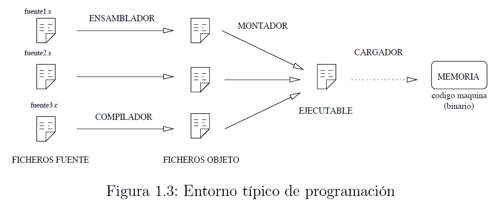

#    Tecnológico Nacional de México
#   Instituto Tecnológico de Tijuana
#        Subdirección Académica

# Departamento de Sistemas y Computación
# Ingeniería en Sistemas Computacionales
# Lenguajes de interfaz 

# Practica Bloque: 2.1
# Objetivo: Lectura y ejercicios de ARM32 del ebook OpenSource


# Galván Rodríguez Ezequiel 17212127
   

# Profesor:
# MC. René Solis Reyes
# Semestre sep 2020 - ene 2021


<a href="http://cooltext.com" target="_top"></a>

ARM es una arquitectura RISC (Reduced Instruction Set Computer = Ordenador con Conjunto Reducido de Instrucciones) de 32 bits. Se trata de una arquitectura licenciable, quiere decir que la empresa desarrolladora ARM Holdings diseña la arquitectura, pero son otras compañías las que fabrican y venden los chips, llevándose ARM Holdings un pequeño porcentaje por la licencia.

### Registros


#### Registros Generales
Su función es el almacenamiento temporal de datos.

#### Registros Especiales
- **SP** - Puntero de Pila. Sirve como puntero para almacenar variables locales y registros en llamadas a funciones.
- **LR** - Registro de Enlace. Almacena la dirección de retorno cuando una instrucción BL ó BLX ejecuta una llamada a una rutina.
- **PC** - Contador de Programa. Es un registro que indica la posición donde está el procesador en su secuencia de instrucciones.

#### Registros CPSR
Almacena las banderas condicionales y los bits de control. Los bits de control definen la habilitación de interrupciones normales (I), interrupciones rápidas (F), modo Thumb (T) y el modo de operación de la CPU. Existen hasta 8 modos de operación. Desde el *Modo Usuario* sólo podemos acceder a las banderas condicionaless, que contienen información sobre el estado de la última operación realizada por la ALU. Existen 4 banderas y son las siguientes:
- **N.** Se activa cuando el resultado es negativo.
- **Z.** Se activa cuando el resultado es cero o una comparación es cierta.
- **C.** Indica acarreo en las operaciones aritméticas.
- **V.** Desbordamiento aritmético.

### Esquema de almacenamiento
Cuando escribimos un dato en una posición de memoria, dependiendo de si es byte, half word o word,... se ubica en memoria según el esquema de la figura 1.2. La dirección de un dato es la de su byte menos significativo.


## El lenguaje Ensamblador
El ensamblador es un lenguaje de bajo nivel que permite un control directo de la CPU y todos los elementos asociados. Cada línea de un programa ensamblador consta de una instrucción del procesador y la posición que ocupan los datos de esa instrucción.

El ensamblador se utiliza como apoyo a otros lenguajes de alto nivel para 3 tipos de situcaciones:
- Operaciones que se repitan un número elevado de veces.
- Cuando se requiera una gran velocidad de proceso.
- Para utilización y aprovechamiento de dispositivos y recursos del sistema.

## El entorno
Los pasos habituales para hacer un programa (en cualquier lenguaje) son los
siguientes: lo primero es escribir el programa en el lenguaje fuente mediante un editor
de programas. El resultado es un fichero en un lenguaje que puede entender el
usuario, pero no la máquina. Para traducirlo a lenguaje máquina hay que utilizar
un programa traductor. Éste genera un fichero con la traducción de dicho programa,
pero todavía no es un programa ejecutable. Un fichero ejecutable contiene el programa
traducido más una serie de códigos que debe tener todo programa que vaya a ser
ejecutado en una máquina determinada. Entre estos códigos comunes se encuentran
las librerías del lenguaje. El encargado de unir el código del programa con el código
de estas librerías es un programa llamado montador (linker) que genera el programa
ejecutable, todo esto se muestra en la figura 1.3.



## Aspecto de un programa en ensamblador
La principal característica de un módulo fuente en ensamblador es que existe una clasra separación entre las instrucciones y los datos. La estructura más general de un módulo fuente es:
- **Sección de datos.** Viene identificada por la directiva .data. En esta zona se definen todas las variables que utiliza el programa con el objeto de reservar memoria para contener los valores asignados.
- **Sección de código.** Se indica con la directiva .text, y sólo puede contener código o datos no modificables.

### Datos
Los datos se pueden representar de distintas maneras. Para representar números tenemos 4 bases, la forma decimal, hexadecimal (se indica con el prefijo Ox), binaria (prefijo Ob) y la octal (con prefijo O)

### Símbolos
En la zona de datos, las etiquetas pueden representar variables, constantes y cadenas. En la zona de código podemos usar etiquetas de salto, fundiones y punteros a zona de datos.

### Instrucciones
Cada instrucción del as (se refiere a ensamblador) se refiere a una operación que puede realizar el microprocesador. Podemos agrupar el conjunto de instrucciones del as, según el tipo de función que realice el microprocesador, en las siguientes categorías:
- ***Instrucciones de tranferencia de datos.*** Mueven información entre registros y posiciones de memoria. Pertenecen a este grupo las siguientes instrucciones: **mov, ldr, str, ldm, stm, push, pop.**
- ***Instrucciones aritméticas.*** Realizan operaciones aritméticas sobre números binarios o BCD. Son instrucciones de este grupo **add, cmp, adc, sbc, mul.**
- ***Instrucciones de manejo de bits.*** Realizan operaciones de desplazamiento, rotación y lógicas sobre registros o posiciones de memoria. Están en este grupo las instrucciones: **and, tst, eor, orr, LSL, LSR, ASR, ROR, RRX.**
- ***Instrucciones de transferencia de control.*** Se utilizan para controlar el flujo de lejecución de las instrucciones del programa. Tales como **b, bl, bx, blx** y sus variantes condicionales.

### Directivas
Son expresiones que aparecen en el módulo fuente e indican al compilador que realice determinadas tareas en el proceso de compilación. Las directivas más frecuentes en el as son:
- ***Directivas de asignación:*** Se utilizan para dar valores a las constantes o reservar posiciones de memoria para las variables, tales como **.byte, .hword, .word, .ascii, .asciz, .zero y .space.**
- ***Directivas de control:*** **.text** y **.data** sirven para delimitar las distintas secciones de nuestro módulo. **.align** es para alinear el siguiente dato, rellenando con ceros.
- ***Directivas de operando:*** Se aplican a los datos en tiempo de compilación. Incluyen: **&, |, ~, +, -, *, /, % , <, >, <<, >>.**
- ***Directivas de Macros:*** Una **.macro** es un conjunto de sentencias en ensamblador que pueden aparecer varias veces repetidas en un programa con algunas modificaciones (opcionales).

## Modos de direccionamiento del ARM
### Direccionamiento inmediato.
El operando fuente es una constante, formando parte de la instrucción.
```bash
mov r0, #1
add r2, r3, #4
```
### Direccionamiento inmediato con desplazamiento o rotación.
Es una variante del anterior en la cual se permiten operaciones intermedias sobre los registros.
```bash
mov r1, r2, LSL #1     /* r1 <- (r2*2) */
mov r1, r2, LSL #2     /* r1 <- (r2*4) */
mov r1, r3, ASR #3     /* r1 <- (r3/8) */
```
### Direccionamiento a memoria, sin actualizar registro puntero.
Es la forma más sencilla y admite 4 variantes. Después del acceso a memoria ningún registro implicado en el cálculo de la dirección se modifica.
```bash
mov r2, #1            /* r2 <- 1 */
str r2, [r1, #+12]    /* *(r1 + 12) <- */
```
### Direccionamiento a memoria, actualizando registro puntero. 
El registro que genera la dirección se actualiza con la propia dirección. De esta forma podemos recorrer un array con un sólo registro sin necesidad de hacer el incremento del puntero en una instrucción aparte.
```bash
mov r2, #0             /* r2 <- 0      */
str r2, [r1], #+4      /* a[0] <- r2   */
str r2, [r1], #+4      /* a[1] <- r2   */
str r2, [r1], #+4      /* a[2] <- r2   */
```
## Tipos de datos
**Tipos de datos básicos.** Son todos los que se muestran en la siguiente tabla.


**Punteros.** Un puntero siempre ocupa 32 bits y contiene una dirección de memoria.

**Vectores.** Todos los elementos de un vector se almacenan en un único bloque de memoria a partir de una dirección determinada. Los diferentes elementos se almacenan en posiciones consecutivas.

**Matrices bidimensionales.** Una matriz bidimensional de NxM elementos se almacena en un único bloque de memoria. Interpretamos una matriz de NxM como una matriz de N fila de M elementos cada una.

## Estructuras de control de alto nivel
Las estructuras for y while se pueden ejecutar un mínimo de 0 iteraciones (si la primera vez no se cumple la condición). La traducción de las estructuras se muestran a continuación.

Estructura del for y while en C
```c
int vi, vf, i;

for (i = vi; i <= vf; i++ ) {
   /* Cuerpo del bucle */
}

i = vi;
while ( i < vf ) {
   /* Cuerpo del bucle */
i++;
}
```

Traducción de las estrucutra for y while. Hemos supuesto que el valor inicial está en la variable vi y el valor final en la variable vf y se ha utilizado el registrado r1 como índice de las iteraciones i.
```bash
         ldr   r1, =vi
         ldr   r1, [r1]
         ldr   r2, =vf
         ldr   r2, [r2]
bucle:   cmp   r1, r2
         bhi   salir
         /* Cuerpo
            del
            bucle */
         add   r1, r1, #1
         b     bucle
salir:
```
Estructura if en C
```c
int a, b;

if (a == b){
   /* Código entonces */
}
else {
   /* Código sino */
}
```

Traducción de la estructura if
```bash
         ldr   r1, =a
         ldr   r1, [r1]
         ldr   r2, =b
         ldr   r2, [r2]
         cmp   r1, r2
         bne   sino
entonces:
         /* Código entonces */
         b     final
sino:
         /* Código */
final:   ...
```


<a href="http://cooltext.com" target="_top"></a>

## Programa 1
```bash
/*    
@@
@@ Instituto Tecnologico de Tijuana
@@ Depto de Sistemas y Computación
@@ Ing. En Sistemas Computacionales
@@   
@@ Autor : Ezequiel Galván Rodríguez @nickname: Ezequiel1721
@@ Repositorio: https://github.com/Ezequiel1721/ResumenARM32.git
@@ Fecha de revisión: 23/10/2020
@@ 
@
@ Objetivo del programa:
@    Suma de elementos de un vector
@-------------------------------------------------------------------------
@                               Sección de Datos
@-------------------------------------------------------------------------
*/

.data

var1 :	.asciz "La suma es %d\n"
var2 :	.word 128, 32, 100, -30, 124


/*
@--------------------------------------------------------------------------
@                               Sección de código
@--------------------------------------------------------------------------
*/

.text
.global main

/* Salvamos registros */
main :	push { r4, lr}

/* Inicializamos variables y apuntamos r2 a var2 */
	mov r0, #5
	mov r1, #0
	ldr r2, = var2

/* Bucle que hace la suma */
bucle : ldr r3, [r2], #4
	add r1, r1, r3
	subs r0, r0, #1
	bne bucle

/* Imprimimos resultado */
	ldr r0, = var1
	bl printf

/* Recuperamos registros y salimos */
	pop {r4, lr}
	bx lr
```
### Corrida:


## Programa 2
```bash
/*    
@@
@@ Instituto Tecnologico de Tijuana
@@ Depto de Sistemas y Computación
@@ Ing. En Sistemas Computacionales
@@   
@@ Autor : Ezequiel Galván Rodríguez @nickname: Ezequiel1721
@@ Repositorio: https://github.com/Ezequiel1721/ResumenARM32.git
@@ Fecha de revisión: 23/10/2020
@@ 
@
@ Objetivo del programa:
@    Suma de un vector de enteros largos
@-------------------------------------------------------------------------
@                               Sección de Datos
@-------------------------------------------------------------------------
*/

.data

var1 :	.asciz "La suma es %lld\n"
var2 :	.word 1600000000, -100, 800000000, -50, 200


/*
@--------------------------------------------------------------------------
@                               Sección de código
@--------------------------------------------------------------------------
*/

.text
.global main

/* Salvamos registros */
main :	push { r4, r5, r6, lr}

/* Inicializamos variables y apuntamos r4 a var2 */
	mov r5, #5
	mov r2, #0
	mov r3, #0
	ldr r4, = var2

/* Bucle que hace la suma */
bucle :	ldr r0, [r4], #4
	mov r1, r0, ASR #31
	adds r2, r2, r0
	adc r3, r3, r1
	subs r5, r5, #1
	bne bucle

/* Imprimimos resultado */
	ldr r0, = var1
	bl printf

/* Recuperamos registros y salimos */
	pop {r4, r5, r6, lr}
	bx lr
```
### Corrida:


## Nota:
Los siguientes programas no muestran nada en pantalla al ejecutarlos debido a que no se utilizaron instrucciones para que hiciera eso, solo se ponen sus corridas con la intención de mostrar que si corren sin ningún problema, dando por entendido que fueron ejecutados de manera correcta.

## Programa 3
```bash
/*    
@@
@@ Instituto Tecnologico de Tijuana
@@ Depto de Sistemas y Computación
@@ Ing. En Sistemas Computacionales
@@   
@@ Autor : Ezequiel Galván Rodríguez @nickname: Ezequiel1721
@@ Repositorio: https://github.com/Ezequiel1721/ResumenARM32.git
@@ Fecha de revisión: 23/10/2020
@@ 
@
@ Objetivo del programa:
@    Suma de dos números
@-------------------------------------------------------------------------
@                               Sección de Datos
@-------------------------------------------------------------------------
*/

.data

var1 : .word 3
var2 : .word 4
var3 : .word 0x1234

/*
@--------------------------------------------------------------------------
@                               Sección de código
@--------------------------------------------------------------------------
*/

.text
.global main
	
main:
	ldr r1, puntero_var1 		/* r1 <- & var1 */
	ldr r1, [r1] 			/* r1 <- *r1 */
	ldr r2, puntero_var2 		/* r2 <- & var2 */
	ldr r2, [r2] 			/* r2 <- *r2 */
	ldr r3, puntero_var3 		/* r3 <- & var3 */
	add r0, r1, r2 			/* r0 <- r1 + r2 */
	str r0, [r3] 			/* *r3 <- r0 */
	bx lr

puntero_var1 : .word var1
puntero_var2 : .word var2
puntero_var3 : .word var3
```
### Corrida:


## Programa 4
```bash
/*    
@@
@@ Instituto Tecnologico de Tijuana
@@ Depto de Sistemas y Computación
@@ Ing. En Sistemas Computacionales
@@   
@@ Autor : Ezequiel Galván Rodríguez @nickname: Ezequiel1721
@@ Repositorio: https://github.com/Ezequiel1721/ResumenARM32.git
@@ Fecha de revisión: 23/10/2020
@@ 
@
@ Objetivo del programa:
@    Suma de dos números utilizando variables tipo byte
@-------------------------------------------------------------------------
@                               Sección de Datos
@-------------------------------------------------------------------------
*/

.data

var1 :	.byte 0b00110010
	.align
var2 :	.byte 0b11000000
	.align

/*
@--------------------------------------------------------------------------
@                               Sección de código
@--------------------------------------------------------------------------
*/

.text
.global main

main :	ldr r1, = var1 		/* r1 <- & var1 */
	ldrsb r1, [r1] 		/* r1 <- *r1 */
	ldr r2, = var2 		/* r2 <- & var2 */
	ldrsb r2, [r2] 		/* r2 <- *r2 */
	add r0, r1, r2 		/* r0 <- r1 + r2 */
	bx lr
```
### Corrida:


### Programa 5
```bash
  
/*    
@@
@@ Instituto Tecnologico de Tijuana
@@ Depto de Sistemas y Computación
@@ Ing. En Sistemas Computacionales
@@   
@@ Autor : Ezequiel Galván Rodríguez @nickname: Ezequiel1721
@@ Repositorio: https://github.com/Ezequiel1721/ResumenARM32.git
@@ Fecha de revisión: 23/10/2020
@@ 
@
@ Objetivo del programa:
@    Probando instrucciones de rotación y desplazamiento
@-------------------------------------------------------------------------
@                               Sección de Datos
@-------------------------------------------------------------------------
*/

.data

var1 :	.word 0x80000000


/*
@--------------------------------------------------------------------------
@                               Sección de código
@--------------------------------------------------------------------------
*/

.text
.global main

main :	ldr r0, = var1			/* r0 <- & var1 */
	ldr r1, [r0] 			/* r1 <- *r0 */
	LSRs r1, r1, #1 		/* r1 <- r1 LSR #1 */
	LSRs r1, r1, #3 		/* r1 <- r1 LSR #3 */
	ldr r2, [r0] 			/* r2 <- *r0 */
	ASRs r2, r2, #1 		/* r2 <- r2 ASR #1 */
	ASRs r2, r2, #3 		/* r2 <- r2 ASR #3 */
	ldr r3, [r0] 			/* r3 <- *r0 */
	RORs r3, r3, #31 		/* r3 <- r3 ROL #1 */
	RORs r3, r3, #31 		/* r3 <- r3 ROL #1 */
	RORs r3, r3, #24 		/* r3 <- r3 ROL #8 */
	ldr r4, [r0] 			/* r4 <- *r0 */
	msr cpsr_f, #0 			/* C=0 */
	adcs r4, r4, r4 		/* rotar izda carry */
	adcs r4, r4, r4 		/* rotar izda carry */
	adcs r4, r4, r4 		/* rotar izda carry */
	msr cpsr_f, # 0x20000000 	/* C=1 */
	adcs r4, r4, r4 		/* rotar izda carry */
	bx lr
```
### Corrida:


## Programa 6
```bash
/*    
@@
@@ Instituto Tecnologico de Tijuana
@@ Depto de Sistemas y Computación
@@ Ing. En Sistemas Computacionales
@@   
@@ Autor : Ezequiel Galván Rodríguez @nickname: Ezequiel1721
@@ Repositorio: https://github.com/Ezequiel1721/ResumenARM32.git
@@ Fecha de revisión: 23/10/2020
@@ 
@
@ Objetivo del programa:
@    Probando instrucciones de multiplicación
@-------------------------------------------------------------------------
@                               Sección de Datos
@-------------------------------------------------------------------------
*/

.data

var1 :	.word 0x12345678
var2 :	.word 0x87654321
var3 :	.word 0x00012345


/*
@--------------------------------------------------------------------------
@                               Sección de código
@--------------------------------------------------------------------------
*/

.text
.global main

main :	ldr r0, = var1 			/* r0 <- & var1 */
	ldr r1, = var2 			/* r1 <- & var2 */
	ldr r2, = var3 			/* r2 <- & var3 */
	ldrh r3, [r0] 			/* r3 <- baja (* r0) */
	ldrh r4, [r1] 			/* r4 <- baja (* r1) */
	muls r5, r3, r4 		/* r5 <- r3*r4 */
	ldr r3, [r0] 			/* r3 <- *r0 */
	ldr r4, [r1] 			/* r4 <- *r1 */
	umull r5, r6, r3, r4 		/* r6:r5 <- r3*r4 */
	smull r5, r6, r3, r4 		/* r6:r5 <- r3*r4 */
	ldrh r3, [r0] 			/* r3 <- baja (* r0) */
	ldr r4, [r2] 			/* r4 <- *r2 */
	smulwb r5, r3, r4 		/* r5 <- r3* baja (r4) */
	smultt r5, r3, r4 		/* r5 <- alta (r3 )* alta (r4)*/
```
### Corrida:


## Programa 7
```bash
/*    
@@
@@ Instituto Tecnologico de Tijuana
@@ Depto de Sistemas y Computación
@@ Ing. En Sistemas Computacionales
@@   
@@ Autor : Ezequiel Galván Rodríguez @nickname: Ezequiel1721
@@ Repositorio: https://github.com/Ezequiel1721/ResumenARM32.git
@@ Fecha de revisión: 23/10/2020
@@ 
@
@ Objetivo del programa:
@    Supón que tienes dos valores 11110000b y 10101010b. Calcula el resultado de
@    hacer una operación AND y una operación OR entre los dos valores.
@-------------------------------------------------------------------------
@                               Sección de Código
@-------------------------------------------------------------------------
*/

.text
.global main

main :	mov r2, # 0b11110000 		/* r2 <- 11110000 */
	mov r3, # 0b10101010 		/* r3 <- 10101010 */
	and r0, r2, r3 			/* r0 <- r2 AND r3 */
	orr r1, r2, r3 			/* r1 <- r2 OR r3 */
	mvn r4, r0 			/* r4 <- NOT r0 */
	mov r0, # 0x80000000
	tst r0, # 0x80000000
	tst r0, # 0x40000000
	bx lr
```
### Corrida:

